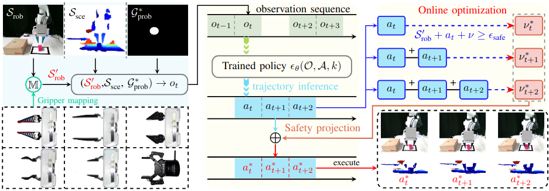

# Pick-and-place manipulation cross grippers without retraining via Learning-optimization Diffusion Policy

<div align="center">
  
</div>

**Pick-and-place manipulation cross grippers without retraining** is a diffusion-based policy for transferring pick-and-place knowledge across different grippers. This knowledge transition does not require retraining or fine-turning the policy with the new gripper’s configuration. Instead, it only needs to introduce the configuration in the policy inference phase and make the generated trajectories satisfy safety constraints, ensuring the successful completion of pick-and-place tasks.

# Algorithms
We provide the implementation of the following algorithms: 
- Simple DP3 MM Proj Flag: `simple_dp3_mm_proj_flag.yaml`
- Simple DP3 MM: `simple_dp3_mm.yaml`
- Simple DP3 Proj Flag: `simple_dp3.yaml`
- Simple DP3: `simple_dp3.yaml`
- Simple DP: `simple_dp.yaml`
- Simple DP Proj: `simple_dp_proj.yaml`

*Simple DP* and *Simple DP3* are the baseline policies. *Simple DP Proj*, *Simple DP3 Proj Flag*, and *Simple DP Proj* are baseline policies with **Safety-Constrained Trajectory Projection**.

*Simple DP3 MM Proj Flag* is our full policy with **Safety-Constrained Trajectory Projection** and **Gripper Mapping**. Both of these 2 policies use robot pose, point cloud, and image from the perspective of the gripper as observations. Our base policy is Simple DP3 MM, and training is on this policy.

# Installation
See [INSTALL.md](INSTALL.md) for installation instructions for **Pick-and-place manipulation cross grippers without retraining**. For certainty map generation, you need to create another conda environment. The installation is following [HybridGen](https://github.com/wangzivector/HybridGen.git):
```bash
cd certainty_map_generator 
conda create --name map_gen python==3.10.4
conda activate map_gen
pip install -r requirements.txt
```
# Real Robot

**Hardware Setup**
1. Franka Robot
2. Franka Gripper
3. Robotiq2F
4. **D455** Realsense Camera 
5. Mounted connection base (connect Franka with Robotiq2F) and Mounted 3D-printed fingertips with different length and width [[link](https://drive.google.com/file/d/1Ii9fPaFdQ9Ytj5jkcw6WOnCQ67B3PmhC/view?usp=sharing)]
6. A PC with Nvidia GPU and PyTorch Framework (For data collection, policy training, and online inference)
7. A workstation with real-time kernel (for real-time control and supervision)

**Software Setup**
1. Ubuntu 20.04.01
2. [Franka Interface Control](https://frankaemika.github.io/docs/index.html) 
3. [Franky](https://github.com/pantor/frankx) (High-Level Motion Library for the Franka Emika Robot)
4. [Robotiq2F](https://github.com/ros-industrial-attic/robotiq.git)
5. [Azure Kinect ROS Driver](https://github.com/microsoft/Azure_Kinect_ROS_Driver.git)
6. [ROS Joystick Drivers](https://github.com/ros-drivers/joystick_drivers.git)
7. [easy_handeye](https://github.com/IFL-CAMP/easy_handeye.git)

**Data Collection**
Run [easy_handeye](https://github.com/IFL-CAMP/easy_handeye.git) to compute the extrinsic matrix for later calibration. It computes an extrinsic matrix between the camera frame and the robot base. This step is run on your workstation with the real-time kernel.

Then, on the PC with Nvidia GPU for data collection, use the following command to collect data into a certain folder:
```bash
cd ./action_infer/catkin_ws/
source devel/setup.bash
rosrun action_infer record_robot_data.py
```
Before this step, install Azure Kinect ROS Driver on your PC with Nvidia GPU. In another terminal, run Azure Kinect ROS Driver **(Caution: Azure Kinect ROS Driver may have bugs on Ubuntu versions after 18.04)**:
```bash
source devel/setup.bash
roslaunch azure_kinect_ros_driver driver.launch
```
On your workstation with real-time kernel, use the following command to send the robot's pose and action to the data collection PC:
```bash
cd ./action_executor/catkin_ws/
source devel/setup.bash
roslaunch teng_arduino joy_controller_no_pc.launch
```
Every collected real robot demonstration (episode length: T) is a dictionary:

1. "point_cloud": Array of shape (T, Np, 3), Np is the number of point clouds, 3 denotes [x, y, z].
2. "rs_img": Array of shape (T, H, W, 3)
3. "azure_img": Array of shape (T, H, W, 3)
4. "azure_depth": Array of shape (T, H, W)
5. "agent_pos": Array of shape (T, Nd), Nd is the action dim of the robot agent, i.e. 7 for the pick-and-place task (6d position of end effector + 1d gripper opened width)
6. "action": Array of shape (T, Nd + 1). We use *relative end-effector position control* for the robot arm and *one-hot encoding (close or open)* for the dex hand.
7. "certainty_map": Graping probability map generated by GG-CNN (T, H, W). Use a script [here](certainty_map_generator/generate_certainty_map.py) to generate grasping probability maps. Following [HybridGen](https://github.com/wangzivector/HybridGen.git) and [GG-CNN](https://github.com/dougsm/ggcnn.git).

For training and real-robot experiments, you should preprocess the point clouds (Hand-on-base calibration, cropping using a bounding box, Grasping Probability Map Star generating and FPS downsampling). Use the following script to package the pickle file as a zarr file.

**Training the policy**
To train the policy. For example:
  ```bash
  bash scripts/train_policy.sh dp3_mm pick-place-kinect-rs-dot 0219 0 0
  ```

**Real-robot experiment**
To run the real-robot experiment, you need to run several nodes. First run Azure Kinect ROS Driver:
```bash
cd ./action_infer/catkin_ws/
source devel/setup.bash
roslaunch azure_kinect_ros_driver driver.launch
```
In another terminal, send certainty maps to the inference module on the PC with Nvidia GPU:
```bash
cd certainty_map_generator 
conda activate map_gen
python3 send_certainty_map_dot.py
```
For the inference module, on the PC with Nvidia GPU, we have four "action_infer" scripts for different policies:
- Simple DP3 MM Proj Flag with Grasping Probability Map Star: `action_infer_mm_queue.py`
- Simple DP3 MM Proj Flag with RGB Image on gripper: `action_infer_mm_queue_rgb.py`
- Simple DP as baseline: `action_infer_dp_queue.py`
- Simple DP3 as baseline: `action_infer_dp3_queue.py`

To run "action_infer", use this command for example:
```bash
cd ./action_infer/catkin_ws/
source devel/setup.bash
rosrun action_infer action_infer_mm_queue.py
```
For the action execution module, on the workstation with real-time kernel, run action execution. For the Franka Panda robot arm mounted with Franka gripper, run this command:
```bash
cd ./action_executor/catkin_ws/
source devel/setup.bash
roslaunch teng_arduino action_execution_with_no_pc.launch
```
For the Franka Panda root arm mounted with Robotiq2F, run this command:
```bash
cd ./action_executor/catkin_ws/
source devel/setup.bash
roslaunch teng_arduino action_execution_with_no_pc_robotiq2f.launch
```
## Videos, training data, and model weights are being organized.

# Acknowledgement
Our code is built upon: [3D Diffusion Policy](https://github.com/YanjieZe/3D-Diffusion-Policy.git), [Diffusion Policy](https://github.com/real-stanford/diffusion_policy), [HybridGen](https://github.com/wangzivector/HybridGen.git), [Constrained Synthesis with Projected Diffusion Models](https://openreview.net/attachment?id=FsdB3I9Y24&name=supplementary_material), [GG-CNN](https://github.com/dougsm/ggcnn.git) We thank all these authors for their nicely open-sourced code and their great contributions to the community.

# Citation
If you find our work useful, please consider citing:
```
@misc{yao2025pickandplacemanipulationgrippersretraining,
      title={Pick-and-place Manipulation Across Grippers Without Retraining: A Learning-optimization Diffusion Policy Approach}, 
      author={Xiangtong Yao and Yirui Zhou and Yuan Meng and Liangyu Dong and Lin Hong and Zitao Zhang and Zhenshan Bing and Kai Huang and Fuchun Sun and Alois Knoll},
      year={2025},
      eprint={2502.15613},
      archivePrefix={arXiv},
      primaryClass={cs.RO},
      url={https://arxiv.org/abs/2502.15613}, 
}
```
